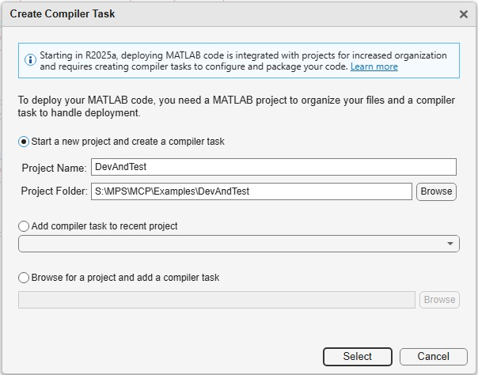
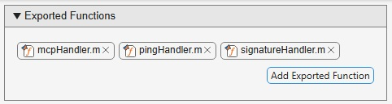
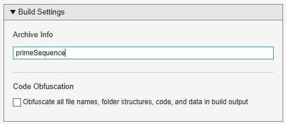
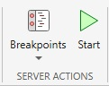
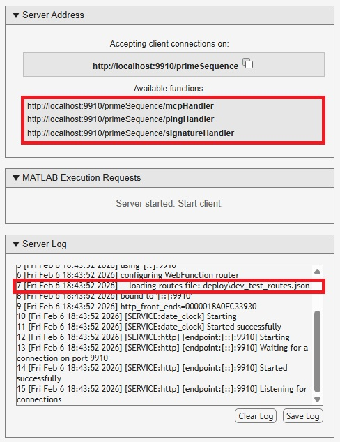

# Debugging MCP Tools with Dev and Test
The `productionServerArchiveCompiler` app provides access to a MATLAB-hosted version of MATLAB Production Server that supports interactive debugging. This allows you to validate your code and its interaction with the MCP Framework for MATLAB Production Server. In this mode, you have complete access to MATLAB's debugging tools. You may step through code and examine and set variable values, for example.

## Example
This example uses the `primeSequence` MCP tool to demonstrate how to use the development version of MATLAB Production Server to test and debug your MCP tool interactively before deploying it.

Copy the files in the `Examples/DevAndTest` folder into a new folder. Start MATLAB and change directory into the folder you just created.

### Create Test Project
Use `prodserver.mcp.build` and `productionServerArchiveCompiler` to create a debuggable test project.
```MATLAB
cd s:\MPS\MCP\Examples\DevAndTest
prodserver.mcp.build("primeSequence",wrapper="None",stop="Routes")
copyfile("deploy/McpServices.mat", ".")
setenv("PRODSERVER_ROUTES_FILE","deploy/dev_test_routes.json")
productionServerArchiveCompiler
```
Choose "Start a new project". You may change the name of the project if desired.



Add the MCP handlers as the project's exported functions.



Set the test archive's name to the archive name used by `prodserver.mcp.build`. By default this is the name of the MATLAB function passed to `prodserver.mcp.build`.



###  Start Server

Press the `Test Client` button in the project toolstrip to open the server control panel.


Start the server with the green start arrow to enable client testing.



The server indicates that the handlers are available and that the routes file has been correctly loaded. If your server does not display this status, your client will be unable to connect. Note: the red highlights were added for emphasis and clarity of this document. They do not appear in the actual display.



Before starting your client, set breakpoints in your MATLAB code or the MCP Framework as desired. Open the debugger window in the server MATLAB and set a breakpoint as usual.

### Test with MATLAB as a Client

1. Start another MATLAB desktop. 
2. Add the MCP Framework to the MATLAB path.
3. Call the primeSequence MCP tool with `prodserver.mcp.call`.

```MATLAB
seq = prodserver.mcp.call("http://localhost/primeSequence/mcp",11,"balanced") 
```

## Your Own Tools

1. Copy the handler files from this folder into your MCP tool's folder: `mcpHandler.m`, `pingHandler.m`, `signatureHandler.m`.
2. Change directory to your MCP tool's folder.
3. Follow the steps in the example, adopting file names, paths and the call to `prodserver.mcp.call` as appropriate for your tool.

--- Copyright 2025-2026 The MathWorks, Inc. ---
