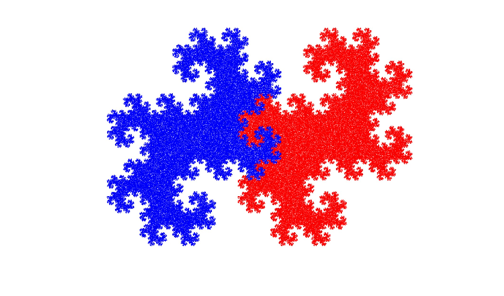

# Tools and the Server

An MCP server may host multiple tools. Build multi\-tool servers with MCP Framework by specifying multiple MATLAB functions to `prodserver.mcp.build`. Tools cannot be added to or removed from an existing server \-\- servers must be rebuilt to add or remove tools.

# Build Server with Seven Tools

By default, a tool has the same name as the MATLAB function that implements the tool. Optionally, tools may be given their own names. MCP clients interact with tool names, not MATLAB function names. This code specifies new names for six of the seven tools. Even though the `snowflake` function is not getting a new name it still must have its tool name specified explicitly, since the `tool` and `fcn` inputs must be the same size.

```matlab
% Tool names -- the names used to call the tool. These are the names
% reported by prodserver.mcp.list.
tool = ["twinDragon", "chaos", "snowflake", "mandelbrot", ...
    "dragonDraw", "turtleGraphic", "renderPointCloud"];

% Functions that implement the tools. Each of these names must be a
% function on MATLAB's path.
fcn = ["chaosdragon", "chaosfractal", "snowflake", ...
    "mandelbrot", "renderDragon", "drawvector", "drawpoints"];

% Build the tools into a Swiss Army knife of a server. Specify a server
% name -- otherwise the server would have the same name as the first tool
% in the tool list.
server = "Fractalizer";
ctf = prodserver.mcp.build(fcn, tool=tool, archive=server, folder="./deploy")
```

```matlabTextOutput
ctf = "S:\gecks\MCP\MCPFramework\Examples\MultiTool\deploy\Fractalizer.ctf"
```

# Deploy the Server

Having successfully built the server, deploy it to an instance of MATLAB Production Server. And then query the endpoint for the list of supported tools. The response to the query provides all the information required to invoke the tool: name, description and input and output schemas.

```matlab
endpoint = prodserver.mcp.deploy(ctf, "localhost", 9910)
```

```matlabTextOutput
endpoint = "http://localhost:9910/Fractalizer/mcp"
```

```matlab
tools = prodserver.mcp.list(endpoint,"Tool")
```


|Fields|name|description|inputSchema|outputSchema|server|
|:--:|:--:|:--:|:--:|:--:|:--:|
|1|'twinDragon'|'Generate N points of the twin-dragon fractal.'|1x1 struct|1x1 struct|1x1 struct|
|2|'chaos'|'Generate N 2D points of a chaos game fractal based on a polygon with the given number of sides. constraint influences the randomness of the chaos.  The second output is the "color point" -- the point on the polygon towards which the 2D point's generative vector points. Astonishingly, all the points that "belong" to a given corner are generated by vectors that point towards that corner. c is expressed in degrees, with the X-axis representing 0 degrees.'|1x1 struct|1x1 struct|1x1 struct|
|3|'snowflake'|'SNOWFLAKE Generate outline of Koch snowflake. SNOWFLAKE iteratively generates the outline of a Koch snowflake using a Lindenmayer system.  [ VECTORS, BBOX ] = SNOWFLAKE(N, WIDTH, HEIGHT)  N: Generate the Nth iteration. Higher numbers generate a smoother outline, but complexity increases quickly: the 4th iteration returns 768 vectors and the 6th 12,288.  WIDTH, HEIGHT: Scale the (unit) vectors to fit within a bounding box of the given dimensions.  VECTORS: A list of 2D turtle-graphics vectors that define the outline of the snowflake. You can draw the snowflake by putting your pen down at 0,0 and moving it along the path defined by the vectors. The entries in VECTORS are NOT X,Y coordinates of points along the outline. Each entry in VECTORS specifies how far and in what direction to move your pen at each step.  BBOX: The actual extent of the snowflake. Guaranteed to be smaller than WIDTH x HEIGHT.  All vectors and coordinates returned as integers.  Example:  [vectors,bbox]=snowflake(6,300,300);  Return a vector list and bounding box for the 6th iteration of the Koch snowflake, scaled to fit inside a 300 x 300 rectangle.'|1x1 struct|1x1 struct|1x1 struct|
|4|'mandelbrot'|'MANDELBROT Generate Mandelbrot set with WIDTH pixels on the X axis. Uses the Escape Time algorithm to determine the color of each point in the fractal.  Algorithms based on the Wikipedia article: http://en.wikipedia.org/wiki/Mandelbrot_set'|1x1 struct|1x1 struct|1x1 struct|
|5|'dragonDraw'|'Generate a JPEG image of the twin-dragon fractal.'|1x1 struct|1x1 struct|1x1 struct|
|6|'turtleGraphic'|'DRAWVECTOR Turtle Graphics for MATLAB. The input vector list specifies a vector path. The end point of vector N is the origin of vector N+1. Draw the vector path, and then draw the bounding box.  Example:  [vectors,bbox] = snowflake(4,300,300); drawvector(bbox, vectors,);'|1x1 struct|1x1 struct|1x1 struct|
|7|'renderPointCloud'|'Produce a JPG image of a set of two-dimensional points.'|1x1 struct|1x1 struct|1x1 struct|


```matlab
toolNames = {tools.name};
thisFolder = replace(fileparts(matlab.desktop.editor.getActive().Filename),filesep,"/");
```
# Create and Display TwinDragon

Used together, the `twinDragon` and `dragonDraw` tools produce an image of the twin dragon fractal. `twinDragon` generates the points of the fractal and `dragonDraw` renders those points into a JPG image. 


The automatically added wrapper functions determine the interface used to call the tool. Typically wrapper functions externalize non\-scalar inputs and outputs into URL\-based data sources and sinks. This prevents large data sets from passing through the large language model, which makes tools faster and cheaper. 


Use the information returned by `prodserver.mcp.list` to view the externalized interface and call the tool.

```matlab
% Find the "twinDragon" tool in the list of seven tools. Look for a tool
% with the name "twinDragon".
tool = "twinDragon";
k = strcmp(tool,toolNames);

% Display the input parameters. There are two: N and dragonURL. The
% structure value of each describes the type and purpose of the input.
tools(k).inputSchema.properties
```

```matlabTextOutput
ans = struct with fields:
            N: [1x1 struct]
    dragonURL: [1x1 struct]

```

```matlab
% N is a number specifying how many points the twin dragon fractal will
% contain.
tools(k).inputSchema.properties.N
```

```matlabTextOutput
ans = struct with fields:
           type: 'number'
    description: 'Number of points in the resulting fractal.'

```

```matlab
% dragonURL is an output location, a URL which must be capable of receiving
% an Nx2 matrix of floating point numbers.
tools(k).inputSchema.properties.dragonURL
```

```matlabTextOutput
ans = struct with fields:
           type: 'string'
    description: 'Nx2 matrix of fractal points. Each row is a single point. Column 1 is the X coordinates, column 2 the Y coordinates.'

```

```matlab
% Setup to generate a fractal with 200,000 points. Return the points in a 
% MAT-file, TwinDragonXY.mat, in the same directory as this file.
N = 200000;
dragonXY = fullfile(thisFolder,"TwinDragonXY.mat");
dragonURL = "file:" + replace(dragonXY,filesep,"/");

% Call the tool using the MCP protocol and check for success: the tool
% should create the MAT-file.
prodserver.mcp.call(endpoint,tool,N,dragonURL);
success = exist(dragonXY,"file") == 2
```

```matlabTextOutput
success = logical
   1

```

```matlab
% Use the information returned by prodserver.mcp.list to determine how to
% call the dragonDraw tool. Note the location of the JPG result is specified 
% by file path rather than by a URL. That's because the JPG location is a
% scalar string input to the original function and thus not subject to an
% externalizing transformation by the wrapper function.
tool = "dragonDraw";
k = strcmp(tool,toolNames);
tools(k).inputSchema.properties
```

```matlabTextOutput
ans = struct with fields:
    dragonURL: [1x1 struct]
       color1: [1x1 struct]
       color2: [1x1 struct]
          jpg: [1x1 struct]
        szURL: [1x1 struct]

```

```matlab
% Setup to call a second tool, dragonDraw, to render the points of the
% fractal into a JPG image. 
jpg = fullfile(thisFolder,"TwinDragonImage.jpg");
color1 = "#FF0000";   % Red
color2 = "#0000FF";   % Blue
dragonSize = fullfile(thisFolder,"TwinDragonSize.mat");
dragonSizeURL = "file:" + replace(dragonXY,filesep,"/");

% Call the dragonDraw tool using the MCP protocol. Test for success by
% looking for the generated JPG file.
prodserver.mcp.call(endpoint,tool,dragonURL,color1,color2,jpg,dragonSizeURL);
success = exist(jpg,"file") == 2
```

```matlabTextOutput
success = logical
   1

```

```matlab
% Display the generated image
figure
img = imread(jpg);
imshow(img);
```


